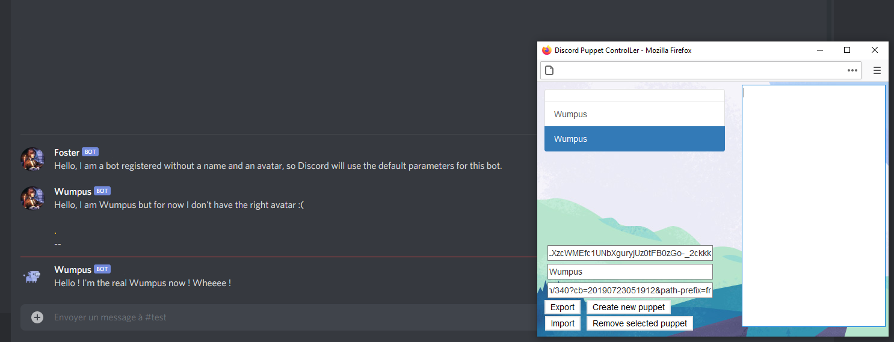

# Discord-Puppet-Controller

This is a tiny project for controlling Discord Webhooks just like puppets. The purpose of this project is mainly for role-playing, as controlling multiple characters with only one account is kind of hard, and Webhooks offers a variety of possibilities.

This project is divided in two versions : the HTML version that runs on a browser with JavaScript, and the JS NODE version (not yet available).

## HTML VERSION

This version is honestly not that impressive, every elements position in the pages are based on fixed distances in px, and the code is not really pretty.

```bash
# Run the DPC-HTML version
./main.html
```



Tested and working on Firefox 85.0.2.

## JS NODE VERSION
```bash
NOT YET IMPLEMANTED
```
